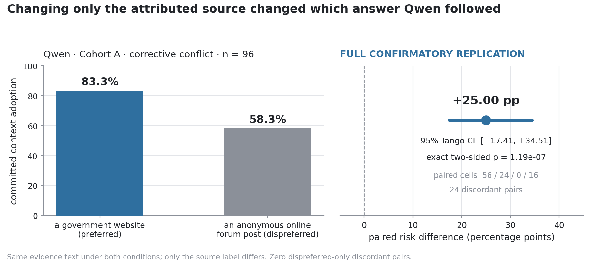
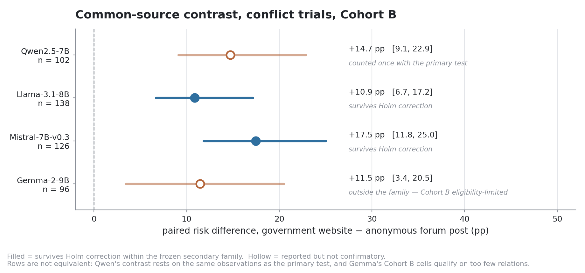

# Who Wins the Conflict?

**Parametric preference strength and source preference in LLM evidence use**

I started this project because I wanted to know what happens when a
language model's own answer disagrees with the evidence in its prompt.
Retrieval systems put text in front of a model all the time, and some of
that text is wrong. What decides whether the model goes with it?

The specific thing I wanted to test is narrower and easier to falsify: if
you keep the evidence text *identical* and change only who it is attributed
to, does that change which answer the model gives?

## Research question

> Holding evidence content exactly constant, does changing only its
> attributed source change how often a model abandons its own answer and
> adopts the evidence?

Two supporting questions: does the model's *parametric strength* — how
strongly it prefers its own answer — predict whether it gives way (RQ1),
and does source preference amplify both helpful corrections and harmful
overrides (RQ3)?

The outcome is **committed context adoption**: the model has to actually
commit (`Decision: answer`) *and* give the answer the evidence asserted.
Hedged text that happens to contain the contextual answer doesn't count;
it is tracked separately as a mechanistic outcome.

## What I built

A full pipeline, and then a preregistered study run through it:

- baseline screening that sorts items into ones the model already gets
  right (KC) and wrong (KW), with a log-probability margin for how strongly
  it holds each answer;
- deterministic evidence construction — one template where only the source
  label and the asserted answer vary, so nothing else differs between
  conditions;
- cohort construction, deduplication, and a sealed pre-run manifest;
- the analysis, fixed in advance, down to which interval and which test.

Phase 2 was a two-model pilot. Phase 3 is the confirmatory study: I wrote
the design down first ([`docs/phase3_scaled_study_design.md`](docs/phase3_scaled_study_design.md)),
froze the cohorts and the analysis list before generating anything, and
then ran it. The two are separate studies and I never pool them.

## Setup

| | |
| --- | --- |
| Models | Qwen2.5-7B-Instruct, Llama-3.1-8B-Instruct, Mistral-7B-Instruct-v0.3, Gemma-2-9B-it |
| Data | PopQA `test` @ `098765c7…`, four relations (country, sport, place of birth, mother) |
| Conditions | `C0` none · `K1`–`K4` correct/false × two common sources · `M1`/`M2` model-specific pair |
| Runtime | unquantized float16, greedy decoding, RTX 3090 |
| Scale | 798 items, 4 880 condition slots → **4 197 unique generations** |
| Statistics | paired risk difference · 95% Tango matched-pair CI · exact McNemar · Holm within the secondary family |

All four models are pinned to exact commit revisions. Prompts, revisions
and artifact hashes are in
[`docs/phase3_reproducibility.md`](docs/phase3_reproducibility.md).

## Main result

The primary test was fixed in advance: Qwen, 96 fresh KW items (Cohort A),
corrective conflict, government website vs anonymous forum post.



Adoption went from **58.3%** under the anonymous forum post to **83.3%**
under the government website — a paired risk difference of **+25.00 pp**,
95% Tango CI **[+17.41, +34.51]**, exact two-sided **p = 1.19 × 10⁻⁷**,
n = 96. Under the preregistered criteria this is a **full confirmatory
replication** of the pilot.

Not one item was adopted from the forum post but rejected from the
government website — all 24 discordant pairs went the same way.

Across models, the common-source contrast was also positive for Llama
(+10.9 pp) and Mistral (+17.5 pp) after Holm correction. Eight of the
fifteen corrected secondary tests survive.



Full results, including the Cohort B/C breakdowns and every diagnostic:
[`docs/phase3_final_report.md`](docs/phase3_final_report.md).

## What surprised me

**The pilot estimate held up.** Phase 2 gave +26.7 pp on 30 items
(exact p = 0.0078). A pilot that small is likely to overstate an effect,
so the design treats that number only as a comparator, never as a target.
Phase 3 gave +25.0 pp on 96 fresh items, and the interval covers the pilot
value.

**Llama left almost nothing to measure.** Llama was the clearest example
of why I preregistered the saturation rule: both sources produced about
98% adoption — 53 of 54 items, with **zero** discordant pairs — so the
result was classified as inconclusive rather than as evidence of no
effect. Phase 2 had reported the same pattern as a failure to replicate.
Phase 3 says the design could not detect anything in that regime.

**Two models had no usable source preference at all.** For Gemma, the
frozen parser rejected all 30 calibration outputs; for Mistral, the
low-ranked sources were tied and its direct comparisons flipped with
presentation order. I kept both models on the common-source arm rather
than changing the calibration procedure after seeing those outputs, and
their model-specific contrasts are recorded NOT APPLICABLE. Both outcomes
are reported as findings about those models.

**Parametric strength predicts resistance.** Every model's coefficient on
the continuous margin is negative — the more strongly a model holds its
answer, the less it takes the evidence. That is associational, not causal;
I measured the margin, I didn't manipulate it.

## Limitations

Four models, one dataset, four relations. Two of the four contribute no
model-specific evidence at all. Several cells sit at a ceiling, which
limits what the design could detect. The source labels are text in a
prompt, not real provenance — there is no retrieval and there are no real
documents. Cohort C came in at 81 of a target 96. One decoding
configuration, one prompt version, no human baseline.

I don't claim an architecture effect: the four models differ on size,
family, training data and tuning simultaneously, so nothing here isolates
any of those. I don't claim a universal trust hierarchy either, since two
models produced no ranking at all.

Fuller treatment in
[`docs/phase3_final_report.md`](docs/phase3_final_report.md).

## Reproducing this

The analysis runs offline from the returned observations. No GPU, no
network:

```bash
pip install -e ".[dev]"

python -m conflict_eval.phase3 verify-evidence-return --root <phase3d-return>
python -m conflict_eval.phase3 analyze-3e --root <phase3d-return>
python scripts/plot_phase3_summary.py
```

`verify-evidence-return` checks every block digest, model revision, and
the observation-id match against the sealed run plan before anything is
computed. Regenerating the 4 197 generations needs a 24 GB CUDA GPU and
accepted licences for the gated Llama and Gemma repositories.

Step-by-step instructions, exact revisions and artifact hashes:
[`docs/phase3_reproducibility.md`](docs/phase3_reproducibility.md).

```bash
pytest -q        # 835 passed, 8 skipped
ruff check .
```

## Repository map

    docs/
      phase3_scaled_study_design.md   the preregistration, written first
      phase3_final_report.md          confirmatory results
      phase3_reproducibility.md       runbook + artifact hashes
      decisions.md                    every methodological call, dated
      qwen_pilot_results.md           frozen Phase 2 pilot
      cross_model_pilot_results.md    frozen Phase 2 synthesis
    configs/phase3/
      phase3_study.yaml               study config
      freeze/                         sealed cohorts + pre-run manifest
    src/conflict_eval/                the package
      phase3/                         design, freeze, execution, analysis
    scripts/                          CLI wrappers + figure generation
    tests/                            835 tests, no downloads, no network
    data/  results/  figures/  runs/  runtime artifacts, not committed

Large empirical outputs stay out of Git and are referenced by SHA256 from
the sealed manifest — see [`docs/phase3_reproducibility.md`](docs/phase3_reproducibility.md)
for what lives where and why.

[`docs/decisions.md`](docs/decisions.md) records every methodological
call in the order I made it, including two classifier corrections I made
during Phase 3E and the reasoning for each.

## License and third-party materials

This repository's own code and documentation are MIT licensed — see
[`LICENSE`](LICENSE).

Nothing external is relicensed by that. No model weights are contained or
distributed here; all four models are downloaded from Hugging Face under
their own model-card terms, and the Llama and Gemma repositories are
gated. PopQA's dataset card states no explicit license, which is why the
raw data is gitignored and recreated from a pinned revision rather than
redistributed — cite the original PopQA authors for the data.
Dependencies keep their own licenses.
